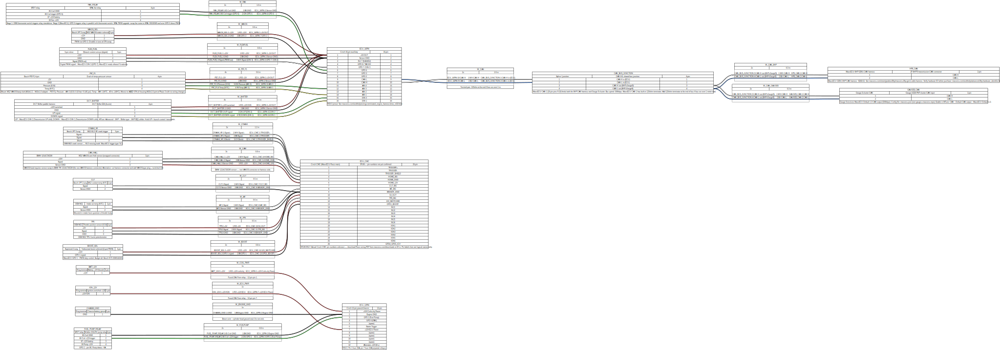
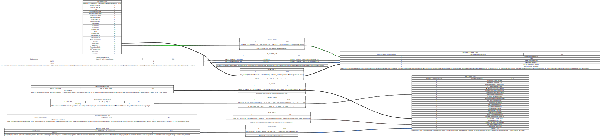
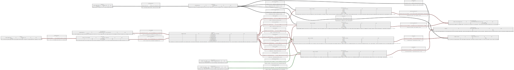
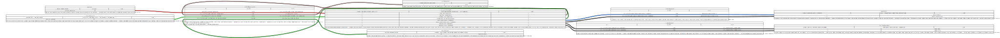
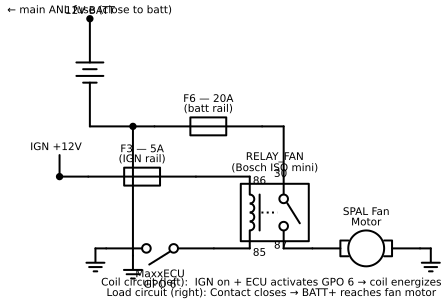

# e36-wiring

Version-controlled wiring harness documentation for an RHD E36 convertible restomod.
Engine: VW 07K 2.5L I5 (turbo, longitudinal) · ECU: MaxxECU Race · Trans: ZF 8HP70

Diagrams are authored in [WireViz](https://github.com/wireviz/WireViz) YAML format — plain text,
git-diffable, outputs SVG/PNG/HTML/BOM automatically.

## Diagrams

Click any link to view the interactive diagram with full BOM in your browser — no code checkout needed.

| Harness | Interactive HTML | Source |
|---|---|---|
| MaxxECU ↔ M52 engine harness | [maxxecu-m52.html](https://htmlpreview.github.io/?https://github.com/wesleyxcooper/e36-wiring/blob/main/output/maxxecu-m52.html) | `harnesses/maxxecu-m52.wv` |
| E36 X20 body connector / Gauge.S | [body-x20.html](https://htmlpreview.github.io/?https://github.com/wesleyxcooper/e36-wiring/blob/main/output/body-x20.html) | `harnesses/body-x20.wv` |
| Power distribution (relay board + fuse block) | [power-distribution.html](https://htmlpreview.github.io/?https://github.com/wesleyxcooper/e36-wiring/blob/main/output/power-distribution.html) | `harnesses/power-distribution.wv` |
| Pierburg CWA400 electric water pump | [ewp-controller.html](https://htmlpreview.github.io/?https://github.com/wesleyxcooper/e36-wiring/blob/main/output/ewp-controller.html) | `harnesses/ewp-controller.wv` |

### MaxxECU ↔ M52 engine harness



### E36 X20 body connector / Gauge.S interface



### Power distribution — relay board and fuse block



### Pierburg CWA400 electric water pump



## Harnesses

| File | Description | Phase |
|---|---|---|
| `harnesses/maxxecu-m52.wv` | MaxxECU Race ↔ M52 engine harness (Phase 1) | 1 |
| `harnesses/maxxecu-07k.wv` | MaxxECU Race ↔ 07K engine harness (Phase 3) | 3 |
| `harnesses/ewp-controller.wv` | Pierburg CWA400 (PWM version) + MaxxECU RACE GPO control | 3 |
| `harnesses/8hp-can.wv` | MaxxECU ↔ 8HP70 CAN harness | 1 |
| `harnesses/gauge-s-can.wv` | MaxxECU ↔ Gauge.S cluster CAN | 1 |
| `harnesses/firewall-bulkhead.wv` | Deutsch AS47/AS79 firewall bulkhead connector (**TODO — not yet authored**) | 1 |
| `harnesses/body-x20.wv` | E36 X20 body connector interface (MaxxECU outputs → dash/instruments) | 1 |
| `harnesses/dct-shifter.wv` | DCT Shifter paddle → MaxxECU DIN wiring | 1 |
| `harnesses/pst-f1-sensor.wv` | Bosch PST-F1 oil temp/pressure → Gauge.S analog inputs | 1 |

## Open TODOs

### `harnesses/firewall-bulkhead.wv` — Firewall bulkhead connector pinout

The firewall bulkhead (Deutsch Autosport AS series or Souriau 8STA, 47-way or 79-way) is the single connector that separates the cabin-side wiring from the engine harness. Defining its pinout in WireViz is the connective tissue between `maxxecu-m52.wv` and `power-distribution.wv`, and is what enables the M52 → 07K engine swap to be a single unplug operation with zero cabin wiring changes.

**Work to do:**
- Extract all engine-crossing signals from `maxxecu-m52.wv` and `power-distribution.wv`
- Assign each signal to a numbered pin in the bulkhead shell, grouped by type (sensors, actuators, power, grounds, CAN)
- Apply contact sizing from the enhancements doc (Size 20 / sensors, Size 16 / injectors+solenoids, Size 12 / power feeds)
- Stub unknowns (shared ground strategy, final wire gauges, pin count choice 47 vs 79)
- Verify total pin count fits chosen shell size
- Replicate the same pinout assignment in the future `maxxecu-07k.wv` so both harnesses mate identically

> **Reference:** Connector options, contact sizing table, cost breakdown, and the two-swap rationale are documented in the private project planning doc — access must be requested from the author:
> https://docs.google.com/document/d/1RNRvGEeiQ2WlrQ-GTXO0aizO8udv_5p_oNJf_OOMEbc/edit?usp=sharing

---

## Key interfaces

- **MaxxECU Race connector:** CMC (Cinch Modular Connector) multi-pin — see `connectors/maxxecu-cmc.wv`
- **Firewall bulkhead:** Deutsch Autosport AS series 47-way (expand to 79-way if needed) — permanent cabin side; engine harnesses mate at the plug
- **E36 X20:** Chassis-to-engine-bay interface — MaxxECU RPM/temp/pressure signals to OEM instrument cluster
- **8HP CAN:** MaxxECU GEN1 8HP CAN harness (native control — no TurboLamik)
- **Gauge.S CAN:** 500kbps, MaxxECU Default 1.3 output protocol

## Reference documentation

- [MaxxECU Race pinout](https://www.maxxecu.com/webhelp/wirings-maxxecu_pinout.html)
- [MaxxECU wiring index](https://www.maxxecu.com/webhelp/wirings.html)
- [MaxxECU M50 terminated harness pinout](https://www.maxxecu.com/webhelp/wirings-terminated_engine_harness-bmw_m50.html)
- [MaxxECU downloads (PDFs, wiring diagrams)](https://www.maxxecu.com/downloads)
- [E36 X20 connector pinout (Scribd)](https://www.scribd.com/document/649295040/bmw-e36-x20-pinout)
- [MaxxECU 8HP GEN1 CAN harness](https://www.maxxecu.com/store/gearbox/8hp/maxxecu-8hp-gen1-cable-harness)
- [WireViz documentation](https://github.com/wireviz/WireViz)

## Setup

```bash
brew install graphviz      # macOS — required, WireViz depends on the dot binary
pip install -r requirements.txt
```

Generate all diagrams:

```bash
wireviz harnesses/*.wv -o output/
```

Generate a single harness:

```bash
wireviz harnesses/maxxecu-07k.wv -o output/
```

Output files go to `output/` — SVGs and HTML are committed to the repo. PNGs and raw `.gv` DOT files are gitignored.

## 07K harness signal map

The M52 and 07K share MaxxECU trigger type (`N-1 missing tooth`, 60-2 wheel). Signal-level changes at engine swap:

| Signal | M52 Phase | 07K Phase | Change |
|---|---|---|---|
| Crank sensor | BMW 60-2 VR | VW 60-2 VR | Different connector, re-calibrate angle offset |
| Cam/home sensor | BMW Hall effect | VW Hall effect | Different connector |
| CLT sensor | BMW NTC | VW NTC | Different connector + recalibrate curve |
| TPS | BMW M52 TPS | VR6 throttle body | Different connector, same 0–5V signal |
| Injectors | Bosch JPT ×6 (EV1) | Bosch EV14 ×5 | Different connector end, 5-cyl |
| VANOS solenoid | GPO 3 active | Not applicable | Disable in tune |
| Wideband O2 | LSU 4.2 | Same | Nothing |
| MAP sensor | Same | Same | Nothing |
| Flex fuel | Digital input | Same | Nothing |
| 8HP CAN | Connected | Still connected | Nothing |

## Circuit schematics (why you need both)

WireViz tells you **which wire goes in which hole**. A circuit schematic tells you **how the circuit actually works**. For building and troubleshooting, you want both.

Example — the same fan relay circuit, two ways:

| WireViz (harness diagram) | Circuit schematic |
|---|---|
| Shows: connector pin numbers, wire colors, cable lengths | Shows: current flow, switching logic, component symbols |
| Answers: "where does this wire terminate?" | Answers: "why does the fan turn on?" |
| Good for: building the loom, ordering parts | Good for: troubleshooting, understanding |

The `schematics/` directory contains Python scripts that generate circuit schematics using [schemdraw](https://schemdraw.readthedocs.io) — a free library that draws proper electrical symbols (relays, fuses, motors, switches, etc.).

### Generate the fan relay schematic

```bash
# Install dependencies (one time)
pip install schemdraw matplotlib

# Generate the schematic
python3 schematics/fan-relay.py

# Open it
open schematics/fan-relay.svg
```

This produces a schematic showing the RELAY_FAN circuit from `power-distribution.wv`:



### Generate the CWA400 EWP schematic

```bash
python3 schematics/ewp-controller.py
open schematics/ewp-controller.svg
```

Shows the Pierburg CWA400 + MaxxECU RACE circuit: BATT+ through 40A relay to CWA400 Pin 3, IGN-switched relay coil, MaxxECU GPO PWM signal (680 Hz) to CWA400 Pin 1, and post-shutdown power hold relay logic. Cross-reference `harnesses/ewp-controller.wv` for physical connector/pin layout.


### How to read the schematic

The fan relay has two completely separate circuits inside one component:

**Coil circuit (left side of relay symbol)** — low current, controls the switch:
- IGN +12V feeds the coil through a 5A fuse → relay pin 86
- MaxxECU GPO 6 is a transistor that pulls relay pin 85 to GND when the ECU commands the fan on
- When both sides of the coil are connected, current flows → magnetic field is created

**Load circuit (right side of relay symbol)** — high current, powers the fan:
- BATT+ sits at relay pin 30 through a 20A fuse, always ready
- When the coil energizes, it magnetically closes the switch (contact)
- Pin 30 connects to pin 87 → BATT+ reaches the fan motor

The dotted line in the relay symbol is the schematic convention for "these two parts are mechanically linked inside the same component."

### Create your own schematic

Copy `schematics/fan-relay.py` and modify it. The `schemdraw` library has elements for everything you need:

```python
import schemdraw.elements as elm

elm.Relay()       # relay (coil + switch contact, dotted link)
elm.Fuse()        # fuse
elm.Motor()       # motor (circle with M)
elm.Battery()     # battery
elm.Switch()      # switch (generic or SPST/SPDT)
elm.Resistor()    # resistor (for termination resistors, pull-ups, etc.)
elm.Diode()       # diode (for flyback protection on relay coils)
elm.Capacitor()   # capacitor
elm.Ground()      # GND symbol
elm.Dot()         # junction dot (wire crossing that connects)
elm.Line()        # plain wire
elm.Label()       # text label anywhere on the diagram
```

Full documentation: https://schemdraw.readthedocs.io

## WireViz authoring gotchas

Hard-won fixes from getting these diagrams to render — save yourself the debugging:

**Install Graphviz separately** — `pip install wireviz` is not enough. Graphviz (`dot`) must be on your PATH.
```bash
brew install graphviz   # macOS
sudo apt install graphviz   # Debian/Ubuntu
```

**Cable lengths need a space** — `1.2m` is a parse error. Use `1.2 m`.
```yaml
# Bad
length: 1.2m
# Good
length: 1.2 m
```

**No `>` characters in `notes:` fields** — WireViz writes notes into graphviz DOT HTML labels. A bare `>` (even as part of `->`) terminates the label token early and produces a cryptic `syntax error near 'X'` in the generated `.tmp` file. Use words instead: `::` for arrows, `over` for comparisons.

**No Unicode in `notes:` fields** — Characters like `Ω`, `→`, `–`, `×` can also break the graphviz DOT parser depending on version. Stick to ASCII in any field that gets rendered (notes, labels, subtypes).

**Connections must strictly alternate connector → cable → connector** — You cannot connect two connectors directly without a cable between them, even for a simple one-wire pass-through. WireViz 0.4+ enforces this and the error message (`Expected cable/arrow, but "X" is connector`) points at the second connector, not the missing cable.

**Color codes are WireViz-specific** — Common confusion with OEM BMW wire color codes:
| OEM code | Meaning | WireViz code |
|---|---|---|
| `SW` | Schwarz (black) | `BK` |
| `GR` | Grau (gray) | `GY` |
| `BL` | Blau (blue) | `BU` |
| `BR` | Braun (brown) | `BN` |

**All referenced connectors must be defined** — If a connector name appears in `connections:` but not in `connectors:`, WireViz fails silently or with a generic error. Stub unknown connectors with `pincount: N` and placeholder `pinlabels`.

## What WireViz can and cannot do

WireViz is a **harness documentation tool**, not a schematic capture tool. It shows physical connectors, wire runs, colors, gauges, and lengths — the kind of diagram a fabricator uses to build a loom.

**It does not have graphical symbols** for resistors, capacitors, relays, diodes, MOSFETs, or any other circuit components. If you want a relay or termination resistor to appear as a schematic symbol, you need a different tool.

For circuit-level schematics alongside this harness documentation, use:
- [KiCad](https://www.kicad.org/) — free, open source, industry-grade schematic + PCB
- [EasyEDA](https://easyeda.com/) — free, web-based, good for quick schematics
- [LTspice](https://www.analog.com/en/resources/design-tools-and-calculators/ltspice-simulator.html) — free, ideal when you also need SPICE simulation (relay coil snubbers, power circuits, etc.)

The typical workflow for a build like this is: WireViz for the harness routing / pinout documentation, KiCad or EasyEDA for any relay/fuse block or power distribution schematic that needs component-level detail.

## Contributing

This is a personal build document. If you're doing a similar swap and have confirmed pinouts or connector part numbers, PRs welcome.
