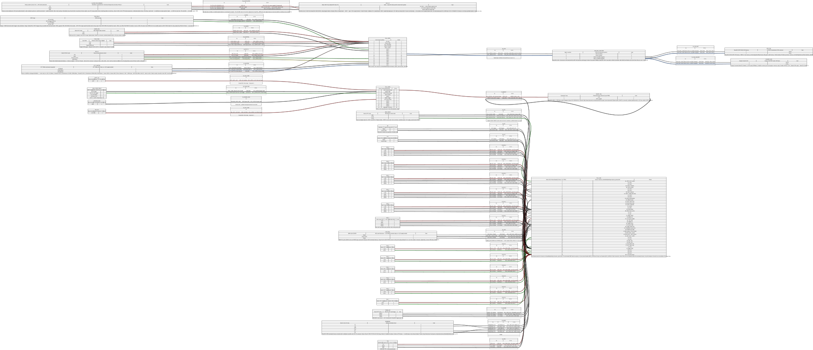
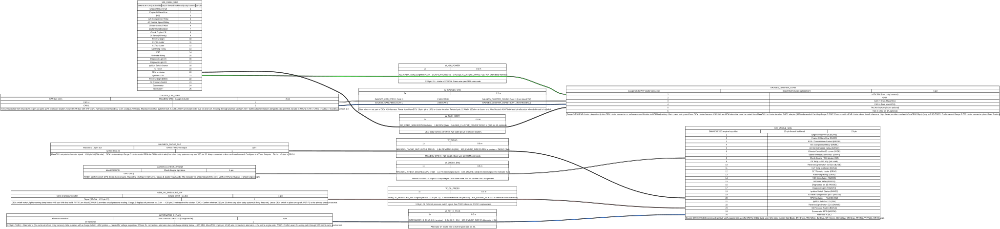
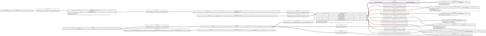
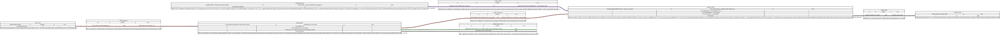
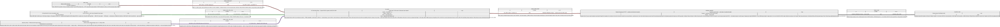
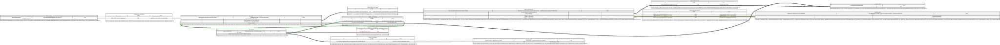
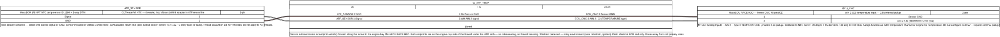

# e36-wiring

Version-controlled wiring harness documentation for an RHD E36 convertible restomod.
Engine: VW 07K 2.5L I5 (turbo, longitudinal) · ECU: MaxxECU Race · Trans: ZF 8HP70

Diagrams are authored in [WireViz](https://github.com/wireviz/WireViz) YAML format — plain text,
git-diffable, outputs SVG/PNG/HTML/BOM automatically.

> **Project plan:** System-level build decisions, parts sourcing, mechanical specs, and phase sequencing live in [`E36_9000RPM_Project_Plan_Verified.md`](https://github.com/wesleyxcooper/e36-build-docs/blob/main/E36_9000RPM_Project_Plan_Verified.md). This repo is the authoritative source for pin assignments, wire colors, connector part numbers, and harness routing — the project plan defers to the `.wv` files for all electrical detail.

## Document Conventions

**Engine lateral sides — always use exhaust/intake, never left/right or driver/passenger.**

Left/right and driver/passenger are LHD-centric and ambiguous in an RHD build. All references in this repo use:

| Term | Meaning |
| :--- | :--- |
| **Exhaust side** | Long side of 07K block with exhaust ports and primary OEM mount bosses |
| **Intake side** | Long side of 07K block with intake ports and oil filter housing |

**Engine longitudinal ends — always use cylinder 1 side / cylinder 5 side, never front/rear.**

Front/rear is ambiguous: in the OEM VW transverse installation "front" means the intake-facing side (a lateral direction in E36). All references in this repo use:

| Term | Meaning |
| :--- | :--- |
| **Cylinder 1 side** | End toward E36 radiator |
| **Cylinder 5 side** | End toward E36 firewall — timing chain / flywheel end in OEM VW (chain compartment at this end; TDC cyl 5 used for timing adj. — charm.li BGP service manual) |

**RHD E36 orientation summary (longitudinal, cylinder 1 side toward radiator):**

| Car position | 07K axis |
| :--- | :--- |
| Driver side (right) | **Exhaust side** — SPA manifold, turbo, downpipe, engine stand adapter |
| Passenger side (left) | **Intake side** — iABED housing, intake manifold |
| Toward radiator | **Cylinder 1 side** |
| Toward firewall | **Cylinder 5 side** — timing chain, crank sensor |

This applies to all harness routing notes, connector location descriptions, and loom routing docs in this repo.

## Diagrams

Click any link to view the interactive diagram with full BOM in your browser — no code checkout needed.

| Harness | Interactive HTML | Source |
|---|---|---|
| MaxxECU ↔ M52 engine harness | [maxxecu-m52.html](https://htmlpreview.github.io/?https://github.com/wesleyxcooper/e36-wiring/blob/main/output/maxxecu-m52.html) | `harnesses/maxxecu-m52.wv` |
| MaxxECU ↔ VW 07K engine harness (Phase 3) | [maxxecu-07k.html](https://htmlpreview.github.io/?https://github.com/wesleyxcooper/e36-wiring/blob/main/output/maxxecu-07k.html) | `harnesses/maxxecu-07k.wv` |
| Deutsch AS79 firewall bulkhead — cabin + M52/07K engine plugs | [firewall-bulkhead.html](https://htmlpreview.github.io/?https://github.com/wesleyxcooper/e36-wiring/blob/main/output/firewall-bulkhead.html) | `harnesses/firewall-bulkhead.wv` |
| E46 DBW pedal → bulkhead pins 72-77 → MaxxECU APS (primary) | [epedal-bmw-e46.html](https://htmlpreview.github.io/?https://github.com/wesleyxcooper/e36-wiring/blob/main/output/epedal-bmw-e46.html) | `harnesses/epedal-bmw-e46.wv` |
| Hella 6PV pedal → bulkhead → MaxxECU APS (RHD fallback) | [epedal-hella-6pv.html](https://htmlpreview.github.io/?https://github.com/wesleyxcooper/e36-wiring/blob/main/output/epedal-hella-6pv.html) | `harnesses/epedal-hella-6pv.wv` |
| ZF 8HP70 TCU CAN + power wiring | [8hp-can.html](https://htmlpreview.github.io/?https://github.com/wesleyxcooper/e36-wiring/blob/main/output/8hp-can.html) | `harnesses/8hp-can.wv` |
| Gauge.S CAN cluster (cabin-to-cabin) | [gauge-s-can.html](https://htmlpreview.github.io/?https://github.com/wesleyxcooper/e36-wiring/blob/main/output/gauge-s-can.html) | `harnesses/gauge-s-can.wv` |
| DCT Shifter paddle → MaxxECU DIN (cabin-to-cabin) | [dct-shifter.html](https://htmlpreview.github.io/?https://github.com/wesleyxcooper/e36-wiring/blob/main/output/dct-shifter.html) | `harnesses/dct-shifter.wv` |
| Bosch PST-F1 oil temp+pressure sensor | [pst-f1-sensor.html](https://htmlpreview.github.io/?https://github.com/wesleyxcooper/e36-wiring/blob/main/output/pst-f1-sensor.html) | `harnesses/pst-f1-sensor.wv` |
| E36 X20 body connector / Gauge.S | [body-x20.html](https://htmlpreview.github.io/?https://github.com/wesleyxcooper/e36-wiring/blob/main/output/body-x20.html) | `harnesses/body-x20.wv` |
| Power distribution (Ecumaster PMU16 PDM) | [power-distribution.html](https://htmlpreview.github.io/?https://github.com/wesleyxcooper/e36-wiring/blob/main/output/power-distribution.html) | `harnesses/power-distribution.wv` |
| Pierburg CWA400 electric water pump | [ewp-controller.html](https://htmlpreview.github.io/?https://github.com/wesleyxcooper/e36-wiring/blob/main/output/ewp-controller.html) | `harnesses/ewp-controller.wv` |
| Radium 20-1170 fuel pump hanger (F90000267 + PMU16 O4 PWM direct) | [fuel-pump-hanger.html](https://htmlpreview.github.io/?https://github.com/wesleyxcooper/e36-wiring/blob/main/output/fuel-pump-hanger.html) | `harnesses/fuel-pump-hanger.wv` |
| PD2-18012AJA 12V electric AC compressor + PWM controller + MaxxECU idle-up | [ac-compressor.html](https://htmlpreview.github.io/?https://github.com/wesleyxcooper/e36-wiring/blob/main/output/ac-compressor.html) | `harnesses/ac-compressor.wv` |
| ATF temp sensor — MaxxECU NTC 1/8 NPT in Vibrant 16488 inline -8AN adapter *(optional)* | [atf-temp-sensor.html](https://htmlpreview.github.io/?https://github.com/wesleyxcooper/e36-wiring/blob/main/output/atf-temp-sensor.html) | `harnesses/atf-temp-sensor.wv` |
| EPowerSteering.com e36 column-assist EPS (Steering ECU, Controller, Adjustment Knob) | [eps-column.html](https://htmlpreview.github.io/?https://github.com/wesleyxcooper/e36-wiring/blob/main/output/eps-column.html) | `harnesses/eps-column.wv` |

### MaxxECU ↔ M52 engine harness



### E36 X20 body connector / Gauge.S interface



### Power distribution — Ecumaster PMU16



### Pierburg CWA400 electric water pump



### Radium 20-1170 fuel pump hanger



Radium 20-1170 + Walbro F90000267 + PMU16 O4 PWM direct (replaces Crydom D1D40 SSR). Cross-reference `fuel-pump-hanger-reference.md` and `schematics/fuel-pump-pwm.py`.

### Alibaba PD2-18012AJA 12V electric AC compressor



Posung PD2-18012AJA (18cc, 3.65 kW / 12,454 BTU, Three-phase PMSM) + included 3-phase inverter/controller + 100A relay. AC enable signal taps to MaxxECU DIN for idle-up compensation. Cross-reference `harnesses/ac-compressor.wv` and `schematics/ac-compressor-pwm.py`.

### ATF temperature sensor *(optional)*



MaxxECU 1/8 NPT NTC sensor (ID 1280) threaded into Vibrant 16488 inline -8AN adapter on the ATF return line. Signal crosses firewall via bulkhead pin 51 (AIN 2 spare temp) to MaxxECU CMC J2. Mechanical thermostat (TCH-102-T2) provides overcooling protection independently — this sensor is logging/cold-shift map only. Cross-reference `harnesses/atf-temp-sensor.wv`.

## Harnesses

| File | Description | Phase | Project Plan |
|---|---|---|---|
| `harnesses/maxxecu-m52.wv` | MaxxECU Race ↔ M52 engine harness (Phase 1) | 1 | [§ harness table L387](https://github.com/wesleyxcooper/e36-build-docs/blob/main/E36_9000RPM_Project_Plan_Verified.md#L387) |
| `harnesses/maxxecu-07k.wv` | MaxxECU Race ↔ VW 07K 5-cyl harness: DBW TB, EV14 injectors, 2x knock, VW sensors; GPO 3/4 freed for ETh motor; single-plug bulkhead swap from M52 | 3 | [§ transition L531](https://github.com/wesleyxcooper/e36-build-docs/blob/main/E36_9000RPM_Project_Plan_Verified.md#L531) |
| `harnesses/ewp-controller.wv` | Pierburg CWA400 (PWM version) + MaxxECU RACE GPO control | 3 | [§ EWP row L461](https://github.com/wesleyxcooper/e36-build-docs/blob/main/E36_9000RPM_Project_Plan_Verified.md#L461) |
| `harnesses/fuel-pump-hanger.wv` | Radium 20-1170 hanger + Walbro F90000267 + DC SSR + MaxxECU PWM GPO | 1 | [§ Fuel System L200](https://github.com/wesleyxcooper/e36-build-docs/blob/main/E36_9000RPM_Project_Plan_Verified.md#L200) |
| `harnesses/ac-compressor.wv` | Alibaba PD2-18012AJA 12V scroll compressor + included PWM controller + 100A relay + MaxxECU DIN idle-up | 2 | [§ AC row L525](https://github.com/wesleyxcooper/e36-build-docs/blob/main/E36_9000RPM_Project_Plan_Verified.md#L525) |
| `harnesses/8hp-can.wv` | MaxxECU CAN + power wiring → ZF 8HP70 TCU (through bulkhead pins 2/3/9/47/48) | 1 | [§ CAN harness L91](https://github.com/wesleyxcooper/e36-build-docs/blob/main/E36_9000RPM_Project_Plan_Verified.md#L91) |
| `harnesses/gauge-s-can.wv` | MaxxECU CAN 1 → Gauge.S E36 cluster (cabin-to-cabin, 500 kbps, Default 1.3) | 1 | [§ Gauge.S row L65](https://github.com/wesleyxcooper/e36-build-docs/blob/main/E36_9000RPM_Project_Plan_Verified.md#L65) |
| `harnesses/firewall-bulkhead.wv` | Deutsch AS79 firewall bulkhead — 79-way, ~59 pins assigned; cabin side permanent, engine plug swaps M52↔07K | 1 | [§ bulkhead callout L391](https://github.com/wesleyxcooper/e36-build-docs/blob/main/E36_9000RPM_Project_Plan_Verified.md#L391) |
| `harnesses/epedal-bmw-e46.wv` | BMW E46 accelerator pedal (35426786282) → bulkhead → MaxxECU APS1/APS2 (**primary option**) | 3 | [§ project plan](https://github.com/wesleyxcooper/e36-build-docs/blob/main/E36_9000RPM_Project_Plan_Verified.md) |
| `harnesses/epedal-hella-6pv.wv` | Hella 6PV010946-141 accelerator pedal → bulkhead → MaxxECU APS1/APS2 (**RHD fallback**) | 3 | [§ project plan](https://github.com/wesleyxcooper/e36-build-docs/blob/main/E36_9000RPM_Project_Plan_Verified.md) |
| `harnesses/body-x20.wv` | E36 X20 body connector interface (MaxxECU outputs → dash/instruments) | 1 | [§ X20 note L527](https://github.com/wesleyxcooper/e36-build-docs/blob/main/E36_9000RPM_Project_Plan_Verified.md#L527) |
| `harnesses/dct-shifter.wv` | DCT Shifter paddle → MaxxECU DIN 1/DIN 2 (cabin-to-cabin, 3-wire, no bulkhead) | 1 | [§ Shifter row L93](https://github.com/wesleyxcooper/e36-build-docs/blob/main/E36_9000RPM_Project_Plan_Verified.md#L93) |
| `harnesses/pst-f1-sensor.wv` | Bosch PST-F1 oil temp+pressure → MaxxECU AIN 1/AIN 3 (through bulkhead pins 27/30/33/34) | 1 | [§ PST-F1 row L67](https://github.com/wesleyxcooper/e36-build-docs/blob/main/E36_9000RPM_Project_Plan_Verified.md#L67) |
| `harnesses/atf-temp-sensor.wv` | ATF temp sensor — MaxxECU NTC 1/8 NPT in Vibrant 16488 inline -8AN adapter, bulkhead pin 51, AIN 2 CMC J2 (**optional**) | 1 | [§ Cooling row L96](https://github.com/wesleyxcooper/e36-build-docs/blob/main/E36_9000RPM_Project_Plan_Verified.md#L96) |
| `harnesses/eps-column.wv` | EPowerSteering.com e36 column-assist EPS — Steering ECU + EPS Controller + Adjustment Knob + Motor Assembly, cabin-only, no MaxxECU/CAN interface | 3 | [§ Power Steering row L369](https://github.com/wesleyxcooper/e36-build-docs/blob/main/E36_9000RPM_Project_Plan_Verified.md#L369) |

## Key interfaces

- **MaxxECU Race connector:** Molex CMC — C1 (48-pin, connector 1) used in M52/07K harnesses; C2 (32-pin, connector 2) carries EGT, knock 2, AIN 5/6, motor 1/2 outputs — not currently wired. Crimp tools: Molex 63811-9200 (small/20 AWG), 63811-8900 (big/0.5–1mm²). Source: [maxxecu.com pinout](https://www.maxxecu.com/webhelp/wirings-maxxecu_pinout.html)
- **Firewall bulkhead:** Deutsch Autosport AS79 (79-way) — permanent cabin side; M52 and 07K engine harnesses each mate at a mating plug for single-connector swaps. Pin assignment: `harnesses/firewall-bulkhead.wv`
- **E36 X20:** Chassis-to-engine-bay interface — MaxxECU RPM/temp/pressure signals to OEM instrument cluster
- **8HP CAN:** MaxxECU GEN1 8HP CAN harness (native control — no TurboLamik)
- **Gauge.S CAN:** 500kbps, MaxxECU Default 1.3 output protocol

## Reference documentation

- [MaxxECU Race pinout](https://www.maxxecu.com/webhelp/wirings-maxxecu_pinout.html)
- [MaxxECU wiring index](https://www.maxxecu.com/webhelp/wirings.html)
- [MaxxECU M50 terminated harness pinout](https://www.maxxecu.com/webhelp/wirings-terminated_engine_harness-bmw_m50.html)
- [MaxxECU downloads (PDFs, wiring diagrams)](https://www.maxxecu.com/downloads)
- [E36 X20 connector pinout (Scribd)](https://www.scribd.com/document/649295040/bmw-e36-x20-pinout)
- [MaxxECU 8HP GEN1 CAN harness](https://www.maxxecu.com/store/gearbox/8hp/maxxecu-8hp-gen1-cable-harness)
- [WireViz documentation](https://github.com/wireviz/WireViz)
- **[`docs/dbw-pinouts.md`](docs/dbw-pinouts.md)** — E46 pedal (bench-verified), Hella fallback pedal, 07K TB pinouts, TB upgrade table, bulkhead pin allocation for DBW
- **[`docs/etb-pid-tuning.md`](docs/etb-pid-tuning.md)** — E-throttle PID tuning: pre-conditions, MTune calibration sequence, PID auto-tune, scope evaluation, symptom table, safety monitoring, TB upgrade re-tune notes
- **[`docs/wiring-bom.md`](docs/wiring-bom.md)** — Consolidated BOM for purchasing: organized by system (power, engine mgmt, e-pedal, fuel, EWP, body); per-run wire color / gauge / length / shielded flag; consolidated wire-to-buy table by gauge+color with 20% slack; connector-to-buy table with part numbers; cross-harness shared items; open TODO list
- **[`docs/loom-routing.md`](docs/loom-routing.md)** — Physical loom routing reference: engine bay trunk + sub-loom breakout points, cabin loom, tunnel/rear fuel run, sleeving spec by zone, breakout discipline. **Fill in during form-board layout / trial-fit session.**
- **[`docs/harness-build.md`](docs/harness-build.md)** — Harness assembly discipline: pin count by connector family (~200–230 total), tool-to-connector matrix, per-family depin procedures (Molex/Deutsch/VW-PTS), 3B0973703G cam/crank label warning, crimp-verify-seat workflow, bench test sequence before sleeving.

## Setup

```bash
brew install graphviz      # macOS — required, WireViz depends on the dot binary
pip install -r requirements.txt
```

Generate all diagrams:

```bash
wireviz harnesses/*.wv -o output/
```

Generate a single harness:

```bash
wireviz harnesses/maxxecu-07k.wv -o output/
```

Output files go to `output/` — SVGs and HTML are committed to the repo. PNGs and raw `.gv` DOT files are gitignored.

## 07K harness signal map

The M52 and 07K share MaxxECU trigger type (`N-1 missing tooth`, 60-2 wheel). Signal-level changes at engine swap:

| Signal | M52 Phase | 07K Phase | Change |
|---|---|---|---|
| Crank sensor | BMW 60-2 VR | VW 60-2 VR | Different connector, re-calibrate angle offset |
| Cam/home sensor | BMW Hall effect | VW Hall effect | Different connector |
| CLT sensor | BMW NTC | VW NTC | Different connector + recalibrate curve |
| TPS | BMW M52 TPS | VR6 throttle body | Different connector, same 0–5V signal |
| Injectors | Bosch JPT ×6 (EV1) | Bosch EV14 ×5 | Different connector end, 5-cyl |
| VANOS solenoid | GPO 3 active | Not applicable | Disable in tune |
| Wideband O2 | LSU 4.2 | Same | Nothing |
| MAP sensor | Same | Same | Nothing |
| Flex fuel | Digital input | Same | Nothing |
| 8HP CAN | Connected | Still connected | Nothing |

## Circuit schematics (why you need both)

WireViz tells you **which wire goes in which hole**. A circuit schematic tells you **how the circuit actually works**. For building and troubleshooting, you want both.

Example — the same fan relay circuit, two ways:

| WireViz (harness diagram) | Circuit schematic |
|---|---|
| Shows: connector pin numbers, wire colors, cable lengths | Shows: current flow, switching logic, component symbols |
| Answers: "where does this wire terminate?" | Answers: "why does the fan turn on?" |
| Good for: building the loom, ordering parts | Good for: troubleshooting, understanding |

The `schematics/` directory contains Python scripts that generate circuit schematics using [schemdraw](https://schemdraw.readthedocs.io) — a free library that draws proper electrical symbols (relays, fuses, motors, switches, etc.).

### Generate the fan relay schematic

```bash
# Install dependencies (one time)
pip install schemdraw matplotlib

# Generate the schematic
python3 schematics/fan-relay.py

# Open it
open schematics/fan-relay.svg
```

This produces a schematic showing the RELAY_FAN circuit from `power-distribution.wv`:


### Generate the CWA400 EWP schematic

```bash
python3 schematics/ewp-controller.py
open schematics/ewp-controller.svg
```

Shows the Pierburg CWA400 + MaxxECU RACE circuit: BATT+ through 40A relay to CWA400 Pin 3, IGN-switched relay coil, MaxxECU GPO PWM signal (680 Hz) to CWA400 Pin 1, and post-shutdown power hold relay logic. Cross-reference `harnesses/ewp-controller.wv` for physical connector/pin layout.


### Generate the E46 DBW pedal schematic

```bash
python3 schematics/epedal-dbw.py
open schematics/epedal-dbw.svg
```

Shows the dual-track hall-effect sensor circuit: MaxxECU +5V SENS1/SENS2 into the pedal module, APS1/APS2 signal outputs back to MaxxECU AIN inputs, both sensor grounds, and the firewall bulkhead crossing point. Annotated with voltage ranges at each key node. Cross-reference `harnesses/epedal-bmw-e46.wv` for physical wire routing.


### Generate the fuel pump PWM schematic

```bash
python3 schematics/fuel-pump-pwm.py
open schematics/fuel-pump-pwm.svg
```

### Generate the 12V electric AC compressor schematic

```bash
python3 schematics/ac-compressor-pwm.py
open schematics/ac-compressor-pwm.svg
```

Shows the Alibaba PD2-18012AJA + included PWM controller circuit: BATT+ through 100A fuse to AC relay (100A ISO mini), relay contact to PWM controller +IN, PWM controller output to compressor motor, IGN-switched AC button to relay coil, and AC enable signal tap to MaxxECU DIN for idle-up compensation. Duty cycle guidance annotated: start at ~45% (≈3,000 RPM, 51–54°F vent at 90°F ambient) — do not run at 95% (≈5,000 RPM causes near-stall idle dip).

Shows the Radium 20-1170 + Walbro F90000267 circuit: BATT+ through 25A fuse to DC SSR Load(+), SSR Load(-) to pump(+) stud on hanger, IGN switched 12V to SSR Ctrl(+), MaxxECU GPO (GND-sink) to SSR Ctrl(-). PWM duty cycle controls pump speed (65% idle → 100% WOT/boost). Cross-reference `harnesses/fuel-pump-hanger.wv` for physical pin layout and `fuel-pump-hanger-reference.md` for full specs and MTune config.

### How to read the schematic

The fan relay has two completely separate circuits inside one component:

**Coil circuit (left side of relay symbol)** — low current, controls the switch:
- IGN +12V feeds the coil through a 5A fuse → relay pin 86
- MaxxECU GPO 6 is a transistor that pulls relay pin 85 to GND when the ECU commands the fan on
- When both sides of the coil are connected, current flows → magnetic field is created

**Load circuit (right side of relay symbol)** — high current, powers the fan:
- BATT+ sits at relay pin 30 through a 20A fuse, always ready
- When the coil energizes, it magnetically closes the switch (contact)
- Pin 30 connects to pin 87 → BATT+ reaches the fan motor

The dotted line in the relay symbol is the schematic convention for "these two parts are mechanically linked inside the same component."

### Create your own schematic

Copy `schematics/fan-relay.py` and modify it. The `schemdraw` library has elements for everything you need:

```python
import schemdraw.elements as elm

elm.Relay()       # relay (coil + switch contact, dotted link)
elm.Fuse()        # fuse
elm.Motor()       # motor (circle with M)
elm.Battery()     # battery
elm.Switch()      # switch (generic or SPST/SPDT)
elm.Resistor()    # resistor (for termination resistors, pull-ups, etc.)
elm.Diode()       # diode (for flyback protection on relay coils)
elm.Capacitor()   # capacitor
elm.Ground()      # GND symbol
elm.Dot()         # junction dot (wire crossing that connects)
elm.Line()        # plain wire
elm.Label()       # text label anywhere on the diagram
```

Full documentation: https://schemdraw.readthedocs.io

## WireViz authoring gotchas

Hard-won fixes from getting these diagrams to render — save yourself the debugging:

**Install Graphviz separately** — `pip install wireviz` is not enough. Graphviz (`dot`) must be on your PATH.
```bash
brew install graphviz   # macOS
sudo apt install graphviz   # Debian/Ubuntu
```

**Cable lengths need a space** — `1.2m` is a parse error. Use `1.2 m`.
```yaml
# Bad
length: 1.2m
# Good
length: 1.2 m
```

**No `>` characters in `notes:` fields** — WireViz writes notes into graphviz DOT HTML labels. A bare `>` (even as part of `->`) terminates the label token early and produces a cryptic `syntax error near 'X'` in the generated `.tmp` file. Use words instead: `::` for arrows, `over` for comparisons.

**No Unicode in `notes:` fields** — Characters like `Ω`, `→`, `–`, `×` can also break the graphviz DOT parser depending on version. Stick to ASCII in any field that gets rendered (notes, labels, subtypes).

**Connections must strictly alternate connector → cable → connector** — You cannot connect two connectors directly without a cable between them, even for a simple one-wire pass-through. WireViz 0.4+ enforces this and the error message (`Expected cable/arrow, but "X" is connector`) points at the second connector, not the missing cable.

**Color codes are WireViz-specific** — Common confusion with OEM BMW wire color codes:
| OEM code | Meaning | WireViz code |
|---|---|---|
| `SW` | Schwarz (black) | `BK` |
| `GR` | Grau (gray) | `GY` |
| `BL` | Blau (blue) | `BU` |
| `BR` | Braun (brown) | `BN` |

**All referenced connectors must be defined** — If a connector name appears in `connections:` but not in `connectors:`, WireViz fails silently or with a generic error. Stub unknown connectors with `pincount: N` and placeholder `pinlabels`.

## What WireViz can and cannot do

WireViz is a **harness documentation tool**, not a schematic capture tool. It shows physical connectors, wire runs, colors, gauges, and lengths — the kind of diagram a fabricator uses to build a loom.

**It does not have graphical symbols** for resistors, capacitors, relays, diodes, MOSFETs, or any other circuit components. If you want a relay or termination resistor to appear as a schematic symbol, you need a different tool.

For circuit-level schematics alongside this harness documentation, use:
- [KiCad](https://www.kicad.org/) — free, open source, industry-grade schematic + PCB
- [EasyEDA](https://easyeda.com/) — free, web-based, good for quick schematics
- [LTspice](https://www.analog.com/en/resources/design-tools-and-calculators/ltspice-simulator.html) — free, ideal when you also need SPICE simulation (relay coil snubbers, power circuits, etc.)

The typical workflow for a build like this is: WireViz for the harness routing / pinout documentation, KiCad or EasyEDA for any relay/fuse block or power distribution schematic that needs component-level detail.

## Contributing

This is a personal build document. If you're doing a similar swap and have confirmed pinouts or connector part numbers, PRs welcome.
